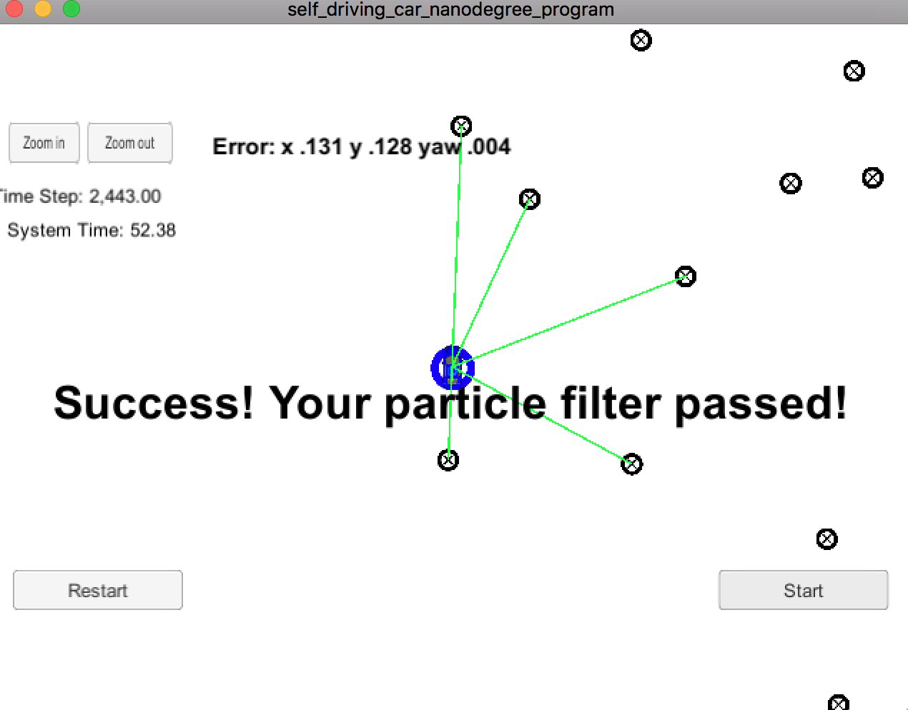

# Project 03 Term 2 - Localization with Particle Filters - Finding a Kidnapped Vehicle
[](http://www.udacity.com/drive)

## README
In this C++ project, I used a two-dimensional particle filter to help localize a car placed in an somewhat unknown location. I began by using less accurate map data (similar to GPS) to initialize my car's location, predicted my new location based on velocity and yaw (turn) rate, transformed sensor observation points into my map coordinates, associated these observations with landmarks on the map, and then calculated the likelihood that a given particle made those observation based off of the landmark positions in the map. The particles were then re-sampled using resampling wheel algorithm.

Along with sufficient accuracy to have localized the vehicle within a small amount of space, the project also required having an efficient algorithm, as there was a time limit to how long it could run for without failing the given parameters.

## RUNNING THE CODE

Once you have this repository on your machine, cd into the repository's root directory and run the following commands from the command line:
```
> ./clean.sh
> ./build.sh
> ./run.sh
```
> **NOTE**
> If you get any `command not found` problems, you will have to install 
> the associated dependencies (for example, 
> [cmake](https://cmake.org/install/))

If everything worked you should see something like the following output:
```
highest w 2.25439e-11
average w 2.25439e-11
highest w 0.10787
average w 0.10787
```
You have to run Term 2 simulator and final output is shown in image below.


### Project Steps
All steps within 'particle_filter.cpp' in the 'src' folder
* Initialization function (estimate position from GPS data using particle filters, add random noise).
* Prediction function (predict position based on adding velocity and yaw rate to particle filters, add random noise).
* Update Weights function - Transformation of observation points to map coordinates (given in vehicle coordinates).
* Update Weights function - Association of landmarks to the transformed observation points.
* Update Weights function - Calculation of multi-variate Gaussian distribution.
* Resample function - Resamples particles using resampling wheel algorithm.
* Optimizing algorithm - Performance within required accuracy and speed.

## Results
### Performance
The particle filter met the requirements, which were 0.2 meter in error for x and y translations, 0.004 rad in error for yaw, and 52 seconds of runtime for the particle filter. Please note that due to the random numbers generated in certain portions of my approach (for the Gaussian distributions), results may vary slightly. Error below is cumulative mean weighted error.

**Using: 21 particles**

**Weight results** 

```
highest w 0.660908
average w 0.629529
```

| Estim |  Error  |
| ----- | ------- |
|   x   | 0.131   | (m)
|   y   | 0.128   | (m)
|  yaw  | 0.004   | (rad)


